<div align="center">

<picture>
  <source media="(prefers-color-scheme: dark)" srcset="docs/brand/bellwether-logo-dark.svg">
  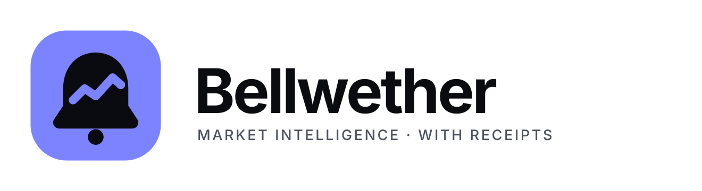
</picture>

**Self-hosted market intelligence for US equities — every claim with a receipt.**

Bellwether watches SEC filings, federal policy, insider and Congressional trades
and the news; ties each event to the companies and sectors it touches; and
tells you, with measured history rather than a hunch, whether events like it
have actually moved prices before.

[](go.mod)
[](web/)
[](docker-compose.yml)
[](LICENSE)

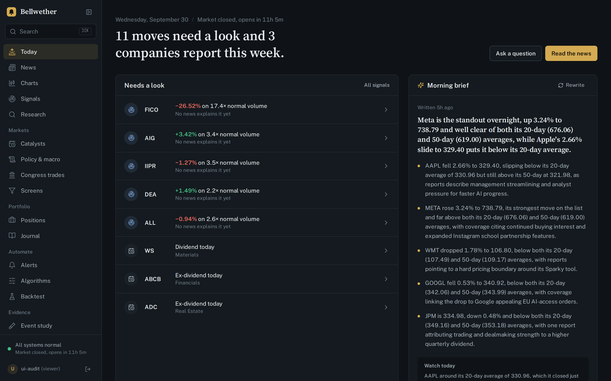

</div>

> **Bellwether places no real orders.** Paper trading uses simulated money,
> and there is no code path to a broker of any kind. It watches, measures,
> forecasts and explains. Analysis tool, not investment advice; data may be
> delayed.

---

## Why

A Bloomberg Terminal costs $24,000 a year, and much of what it sells is the
link between a world event and your positions. Retail tools show you *what*
moved, rarely *why*, and never which of *your* holdings a rule change, a filing
or a Congressional trade actually reaches. AI finance chatbots answer
confidently and cite nothing — you cannot audit them, so you cannot trust them.

Bellwether fills that gap on a small VPS (4 GB of RAM is plenty):

```
filing · policy change · world event  ──▶  which sectors it reaches
                                      ──▶  which of your holdings sit there
                                      ──▶  what events like it did before
                                      ──▶  the sources, so you can check
```

## What makes it trustworthy

**Provenance you can audit.** Every event keeps three timestamps — when it
happened, when it was published, and when *this system* discovered it — and
only the last is ever used to reason about what was knowable when. Look-ahead
bias isn't avoided by convention; it's structurally impossible. Every event
links to every source that reported it, ranked by trust.

**Statistics decide what to look at; models only explain it.** A scanner reads
price and volume across the S&P 1500 every session and flags what is abnormal
*before any article exists about it*. Models are the last stage of the
pipeline, never the first.

**The right model for each job.** Thousands of small classification decisions a
day go to [Jev](https://typesafe.ai), a typed decision model whose answers come
with a calibrated confidence — and are thrown out when that confidence is too
low. Prose goes to any OpenAI-compatible model, behind a hard daily dollar cap
that concurrent calls cannot overshoot.

**Citations or it didn't happen.** Research cites its sources, flags where they
disagree and names what they fail to establish. A citation to a source that was
never supplied is stripped; a finding with no valid citation is dropped, not
softened. Every AI forecast is scored against what actually happened, and the
track record has its own page.

## A tour of the app

Every screen below is a real page of a running instance. Times always show
their zone — New York by default, your own or UTC from the status menu.

### Today — what needs a look right now

The landing page answers one question: *what changed since I last looked?* It
lists moves the scanner flagged that no news explains yet, ex-dividend and
earnings dates arriving this week, and a **morning brief** written before the
open from the stocks you watch — every bullet traceable to a source. *Ask a
question* jumps to Research; *Read the news* to the feed.

### News — every story, with its receipts

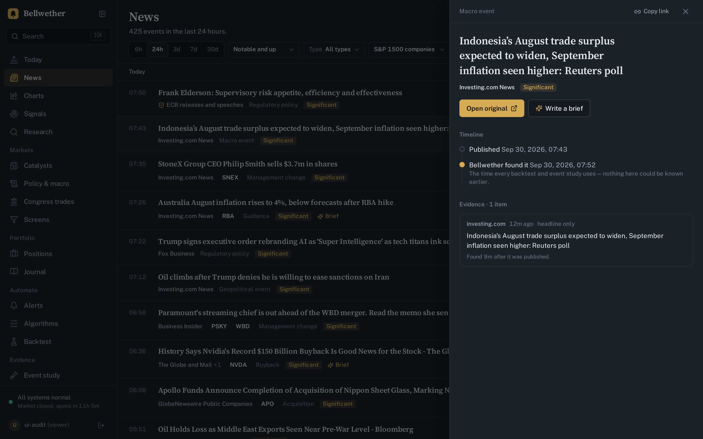

Around 80 sources feed one stream: SEC EDGAR (8-Ks, insider Form 4s, 13Fs),
the Federal Register, the Fed, the White House, BLS, the FTC, the wires and the
financial press, GDELT, targeted discovery queries and one query per stock you
watch. Stories are de-duplicated, matched to companies, and classified into
roughly 50 event types with an importance and a direction.

Click any row to open its **evidence drawer**: the publication time, the time
Bellwether found it (the one every backtest uses), the companies involved and
every source that reported it. *Write a brief* turns the event into a cited
summary on demand.

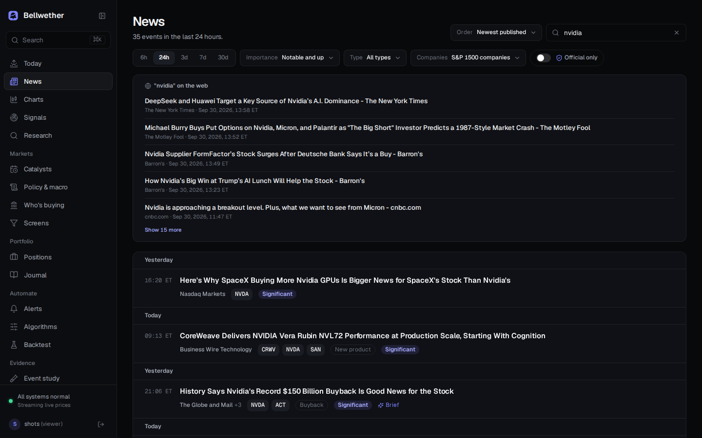

Search is not limited to the archive. A query also asks the open web — a
private SearXNG node, Bing News and Google News, all keyless — and shows those
headlines beside your results, clearly marked as discovery.

### Charts — one stock, everything known about it

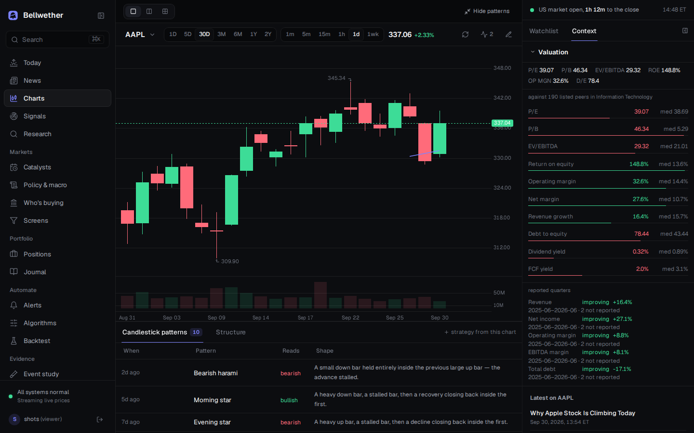

Candles from 1 minute to weekly with indicators, candlestick-pattern detection,
drawing tools and multi-chart layouts. The **Context** tab sits beside it:

- **Valuation** against the stock's sector peers, with the peer median.
- **Latest news and signals** for the symbol.
- **Explain today's move** — a sourced AI explanation.
- **Debrief the last month** — what happened, against the news.
- **Outlook** — a probabilistic forecast that is logged and later scored.
- **On the web** — fresh headlines from outside the archive.

### Forecast — which stocks are likely to outperform next

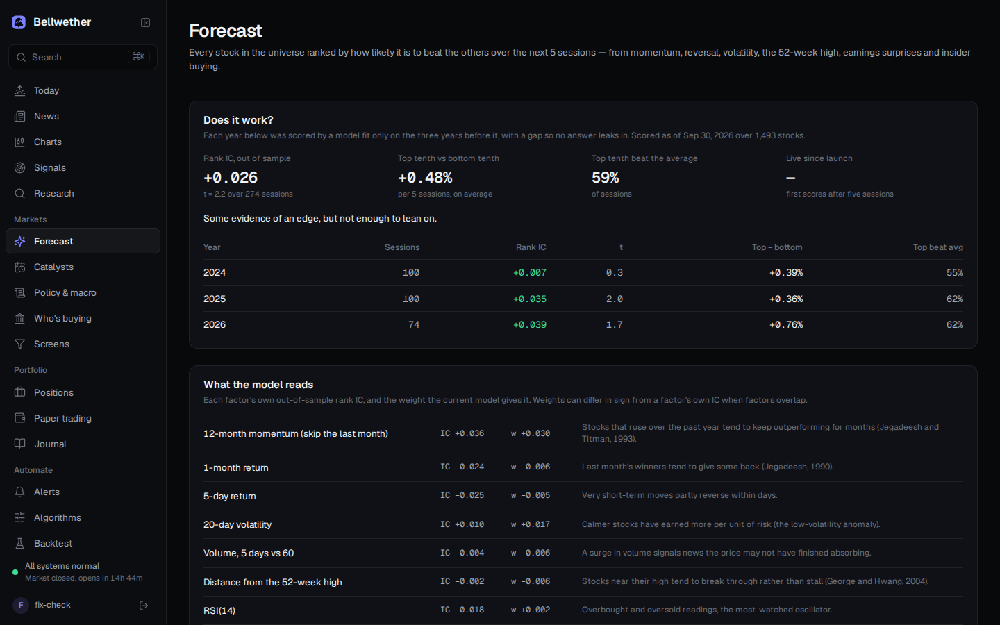

After every close a model ranks the whole universe by how likely each stock is
to beat the others over the next five sessions. It reads factors with decades
of research behind them — 12-month momentum, short-term reversal, low
volatility, the 52-week high, the latest earnings surprise and opportunistic
insider buying — and combines them with a ridge regression whose weights are
on the page. It is validated **walk-forward**: each year is scored by a model
fit only on the three years before it, and every live prediction is logged and
scored once its five sessions have passed. The page leads with that record,
not with the picks.

### Signals — the scanner

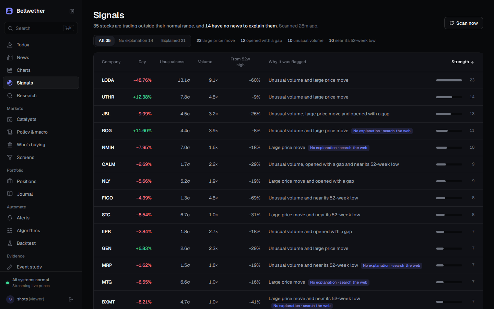

Every half hour of the session the scanner compares each of ~1,500 stocks with
its own history: return and volume z-scores, gaps, distance from highs and
lows. It flags the abnormal ones and checks whether the archive already
explains them. A move nothing explains is one click from a web search for
*why*, and Bellwether starts watching that stock's news harder.

### Screens — filter the universe

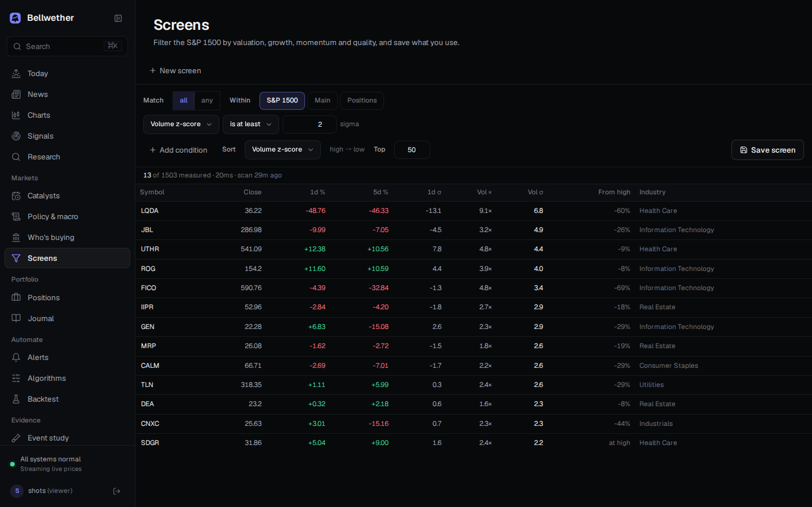

Build and save multi-factor screens (valuation, growth, momentum, scanner
metrics) and run them over the S&P 1500.

### Policy & macro — which of my holdings does this touch?

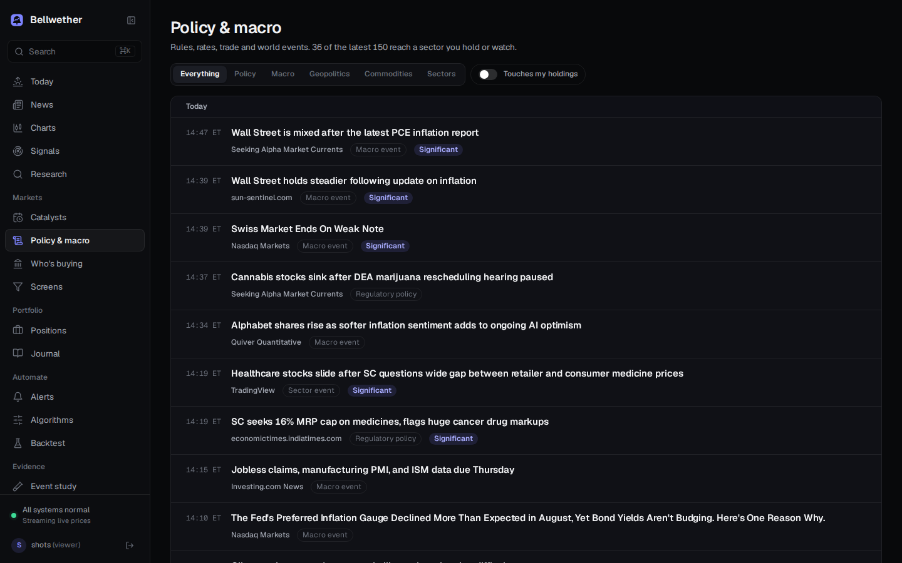

Rules, tariffs, executive orders and central-bank decisions are mapped to the
sectors they reach — by the issuing agency where the source states one (USTR →
trade-exposed sectors, FDA → healthcare), by keywords otherwise — and then to
*your* watchlist and positions.

### Who's buying — insiders, funds and Congress

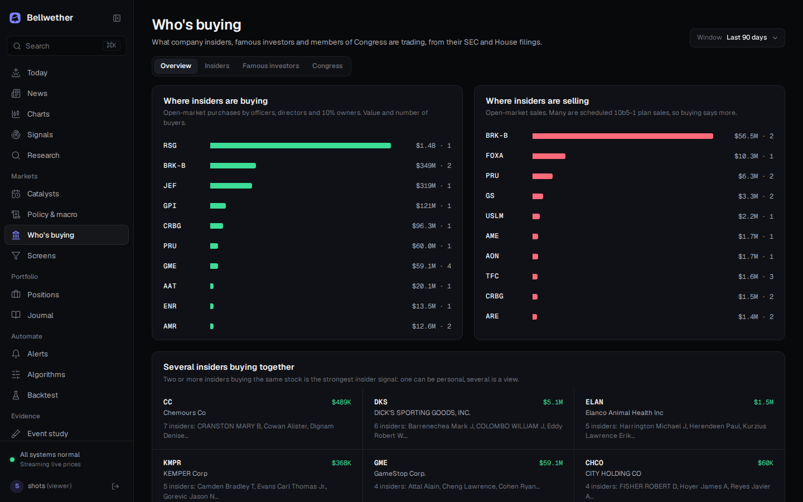

Three official, free sources of "who is putting money where":

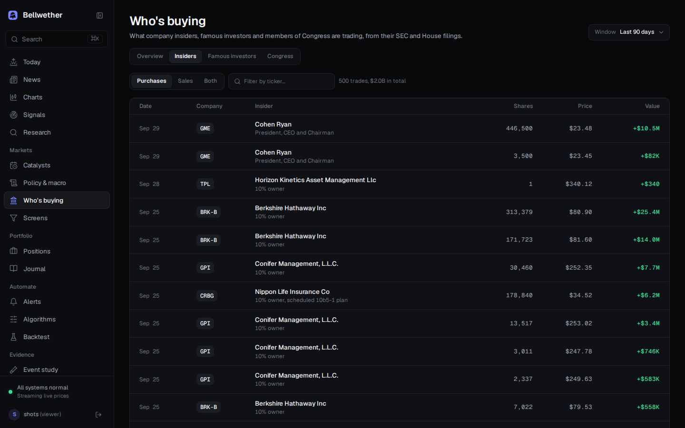

- **Insiders** — officers' and directors' trades from SEC Form 4 for every US
  listing, within minutes of filing, with three years of history from SEC's
  quarterly datasets.
- **Funds** — 64 well-known managers, from Berkshire and Pershing Square to
  Citadel, Norges Bank and Saudi Arabia's PIF, and any other 13F filer you
  search for by name and follow. Each portfolio is searchable, filterable by
  what changed, sortable and paged, however many thousand positions it holds.

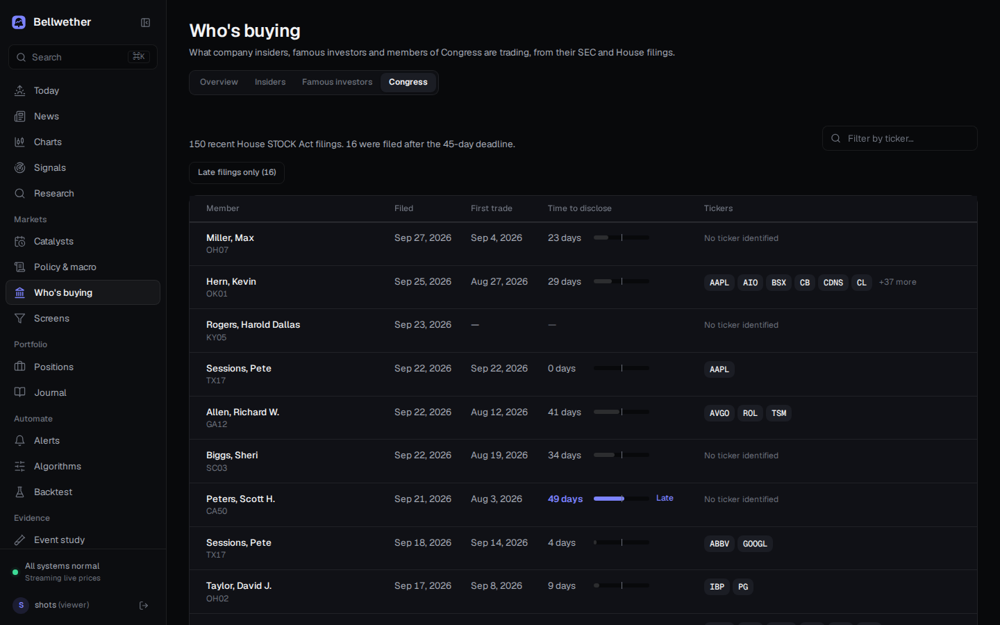

- **Congress** — House STOCK Act disclosures, including how late each was filed
  against the 45-day deadline (lateness is itself a signal).

### Catalysts — what is coming, and how it usually goes

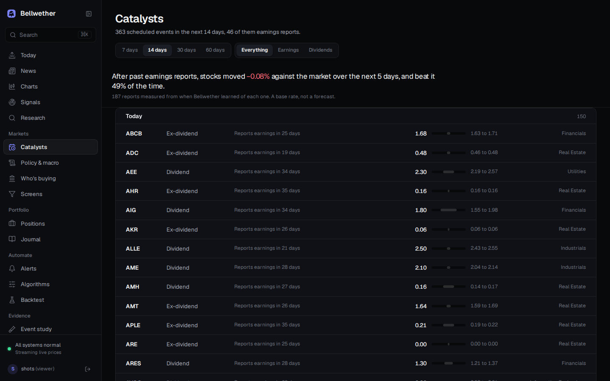

Upcoming earnings and dividends across the universe, each with the **base
rate** from the event study attached: how stocks have typically moved after the
same kind of report. A base rate, not a forecast.

### Event study — does this kind of news move prices?

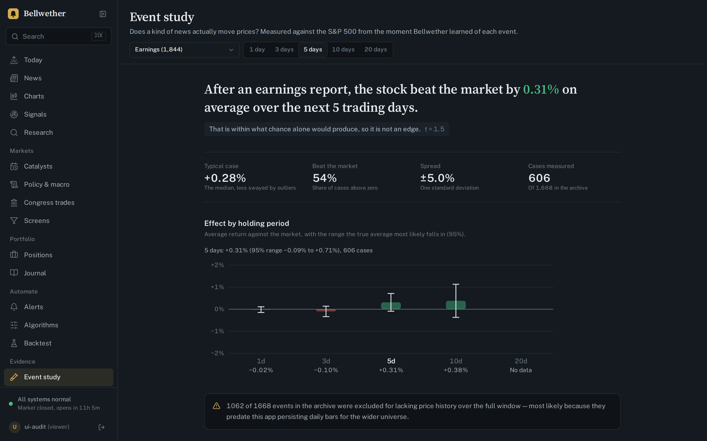

Pick a kind of event and see two numbers against the S&P 500: the **reaction**
(the close before the news to the first close after) and the **drift** a
buyer would have earned over the following days, split into groups — earnings
beats and misses by size from 60,000+ announcements since 1999, insider buying
by who bought, news by how it was read. Each case is timed from the moment the
news was knowable, so the study cannot leak the future.

### Research — a cited answer, or just the evidence

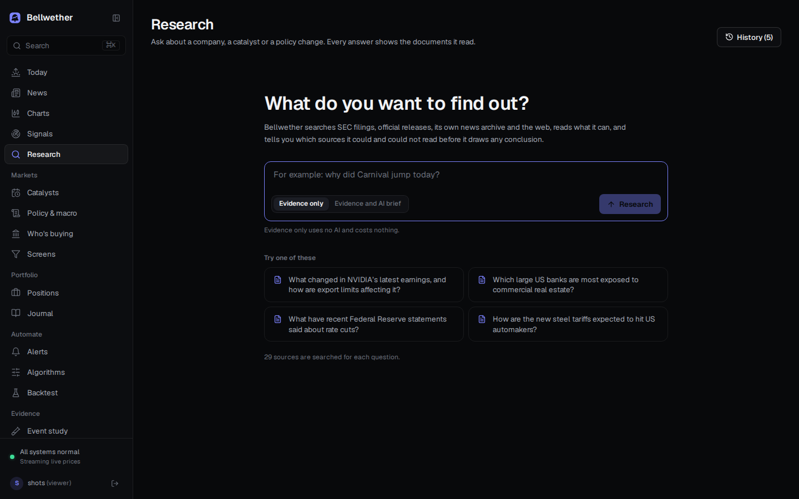

Ask a question in plain English. Bellwether searches SEC filings, official
releases, its own archive, measured price history and the open web, reads what
it can, and either shows you the **evidence only** (the default, no AI call) or
writes a cited **AI brief**. Claims without a valid citation are dropped, and
sources that failed or could not be read are listed as gaps.

### Paper trading — does the strategy actually make money?

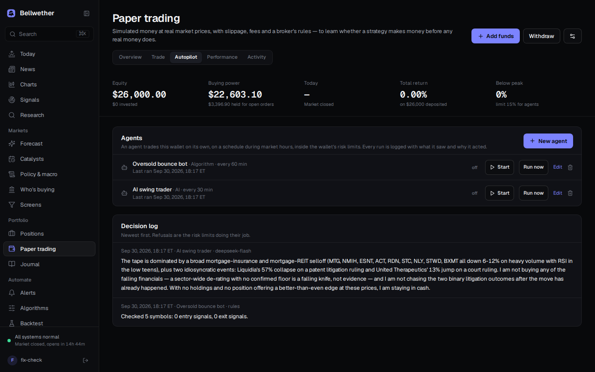

Open a wallet with simulated money and trade it at real market prices. It is
built to be as strict as a real account so the answer means something:

- **Money is whole cents in a double-entry ledger** — every deposit, fill and
  fee is a balanced transaction, and each payment goes through a provider
  lifecycle with an idempotency key, so a card processor can replace the
  simulator later without touching the books.
- **Fills are realistic** — market orders only in session hours, slippage,
  the SEC and FINRA fees a broker passes on, limits that fill only when the
  market trades through them, stops that gap, the pattern-day-trader rule
  under $25,000, and stop-loss and take-profit exits that cancel each other.
- **Agents trade it for you** — an AI agent, one of your saved algorithms, or
  your own code over a signed webhook, each on a schedule, all held to the
  wallet's risk limits (position size, daily loss, drawdown halt, trades a
  day). Every decision is logged with what the agent saw and why.
- **Skill or luck** — performance is read against the S&P 500 with beta and
  alpha, week by week against your goal, and against 1,000 random traders who
  made the same number of trades in the same stocks and period.

### Positions & journal — your money, in context

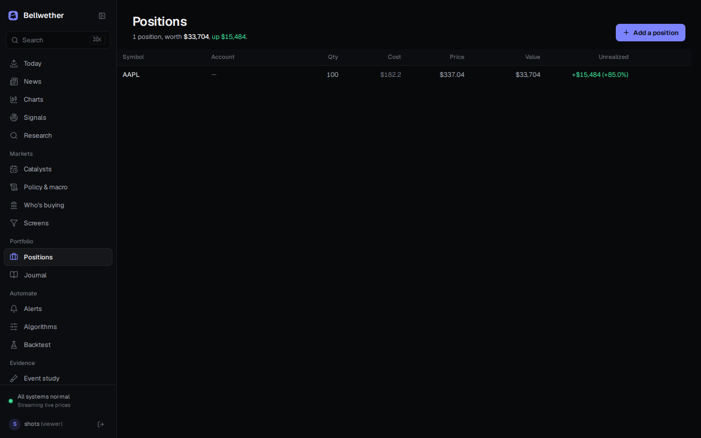

**Positions** records what you hold so Bellwether can tell you when news
reaches real money. Closed paper trades land in the journal too.

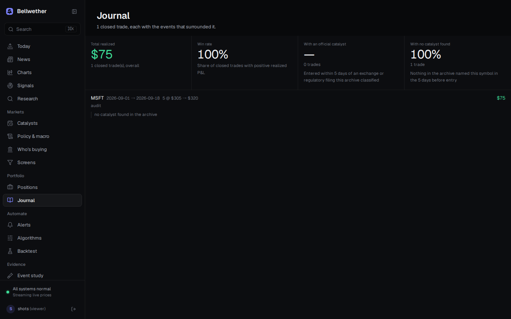

The **journal** sets each closed trade against the events that came before it,
using only what was already known — never a later one — so you can see what
you acted on. Record any trade you closed elsewhere with *Record a trade*.

### Algorithms, backtests and alerts

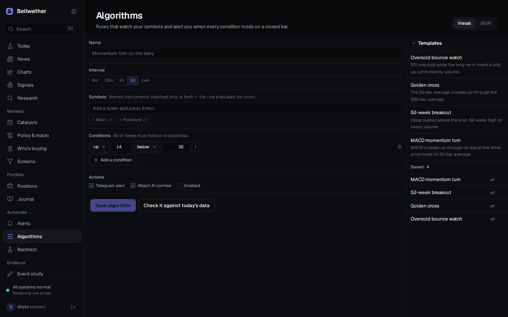

Write a rule in a small JSON language over indicators (RSI, moving averages,
MACD, ATR, VWAP and more). Missing data is *unknown*, and unknown never fires.
Rules run on a schedule and on demand.

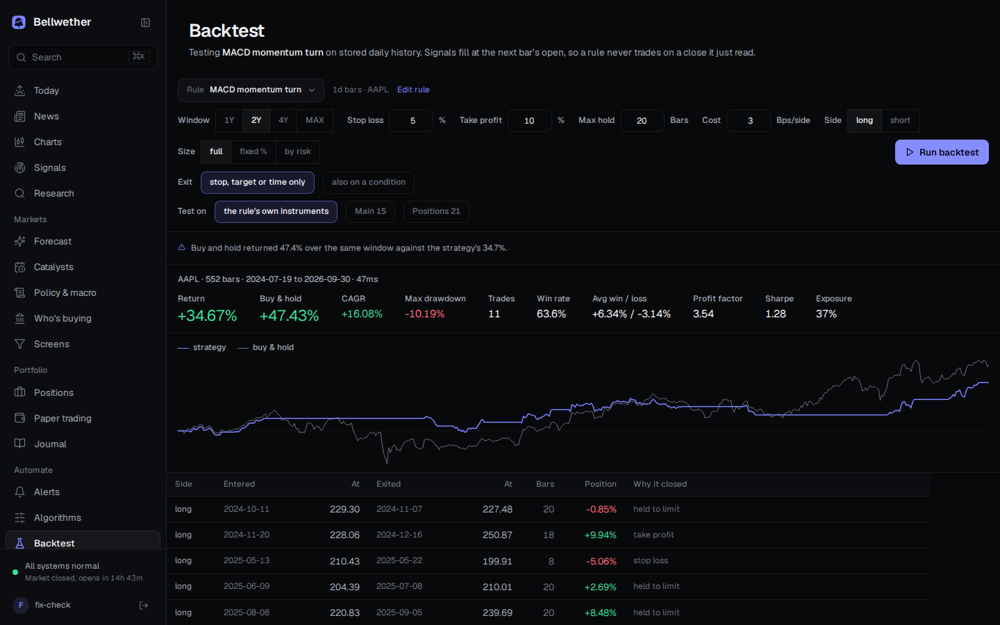

The **backtester** replays a rule over history with transaction costs, stop
losses and take-profits, and only ever sees the bars that existed at each step.

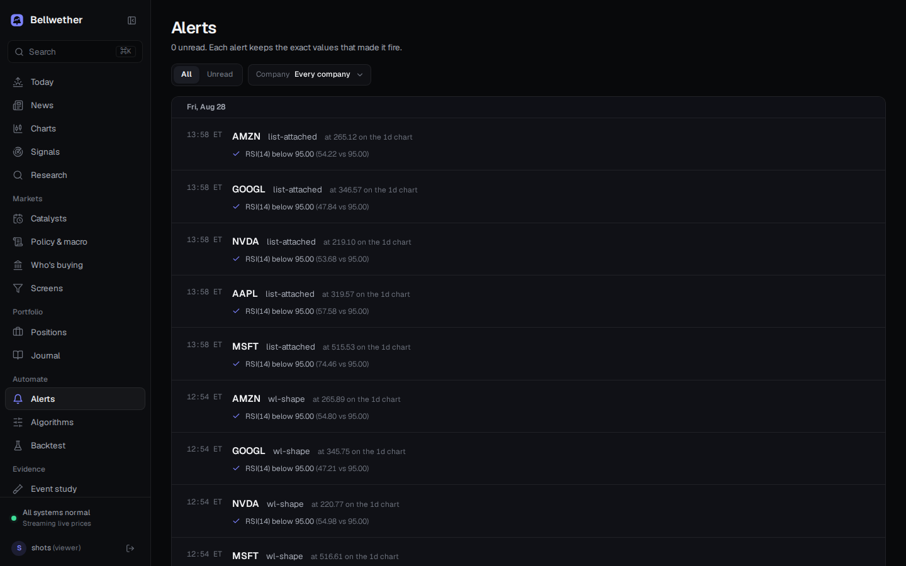

**Alerts** deliver rule triggers to Telegram and the in-app feed, keeping the
full evaluation snapshot for audit, with cooldowns so one condition does not
repeat.

### Sources and AI track record — can I trust it?

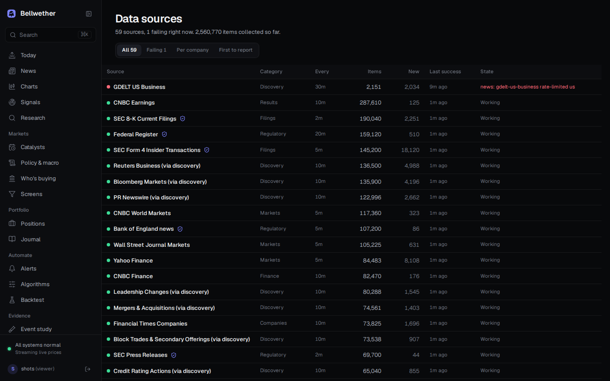

**Data sources** lists every feed with its trust tier, how often it is polled,
how fast it breaks stories and whether it is healthy.

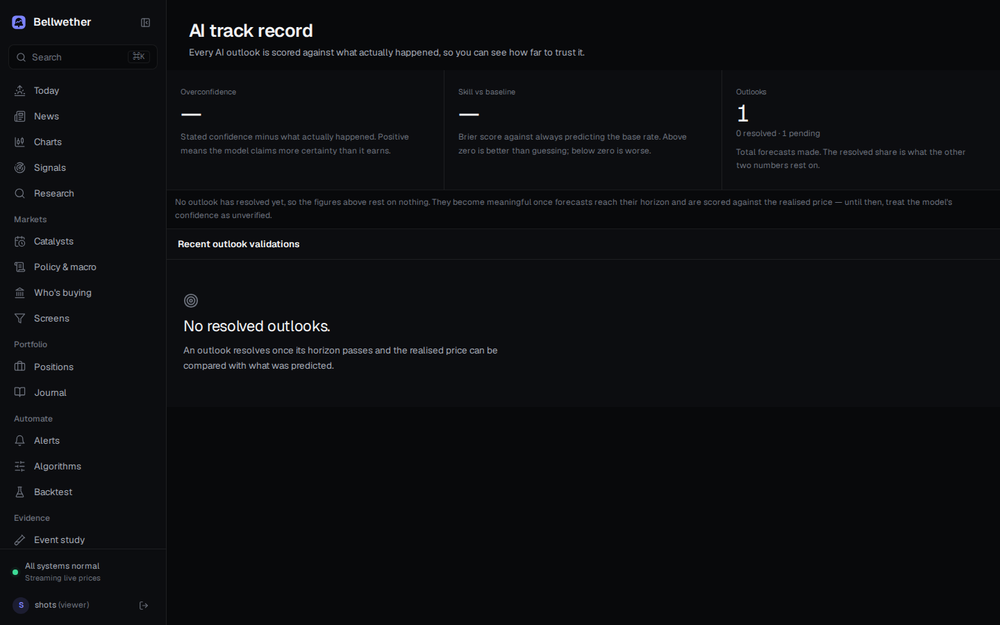

**AI track record** scores every logged forecast against the realised move —
calibration, skill against a naive baseline and the forecasts themselves — so
you know how far to trust the model. Scoring needs no model call, so it stays
current even when the budget is spent.

## Quick start

You need Docker. Nothing else — no keys are required to start.

```bash
git clone https://github.com/premalshah999/BELLWETHER.git bellwether && cd bellwether
cp .env.example .env
docker compose up -d
docker compose exec tradesys tradesys -issue-key -name "alice" -role owner
```

Open <http://localhost:8080> and sign in with the key it printed.

Out of the box you get the official sources, prices from the bundled yfinance
sidecar, the scanner, Congress, the event study, web search through the bundled
SearXNG node, and evidence-only research. Each key you add switches on more:

| Add | To get |
| --- | --- |
| `SEC_USER_AGENT` — a contact string, no signup | SEC filings: 8-Ks, insider trades, 13Fs |
| `TYPESAFE_API_KEY` | Jev classification: event type, importance, direction |
| `LLM_BASE_URL` + `LLM_API_KEY` (DeepSeek, OpenAI, Ollama…) | briefs, explanations, outlooks, AI research answers |
| `TELEGRAM_BOT_TOKEN` + `TELEGRAM_CHAT_ID` | alerts on your phone |
| `PUBLIC_HOSTNAME` + `COMPOSE_PROFILES=public` | HTTPS on your own domain via Caddy |

Every variable is annotated in [`.env.example`](.env.example).

## How it works

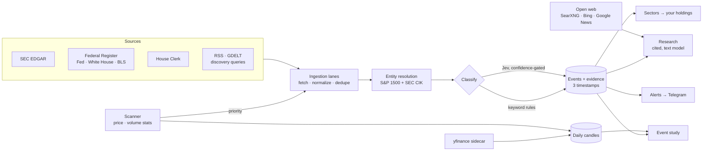
```mermaid
flowchart LR
    subgraph Sources
        SEC[SEC EDGAR]
        FR[Federal Register<br/>Fed · White House · BLS]
        HC[House Clerk]
        NEWS[RSS · GDELT<br/>discovery queries]
    end
    WEB[Open web<br/>SearXNG · Bing · Google News]
    Sources --> ING[Ingestion lanes<br/>fetch · normalize · dedupe]
    ING --> RES[Entity resolution<br/>S&P 1500 + SEC CIK]
    RES --> CLS{Classify}
    CLS -->|keyword rules| EV[(Events + evidence<br/>3 timestamps)]
    CLS -->|Jev, confidence-gated| EV
    SCAN[Scanner<br/>price · volume stats] -->|priority| ING
    YF[yfinance sidecar] --> CAND[(Daily candles)]
    SCAN --> CAND
    EV --> SEC2[Sectors → your holdings]
    EV --> STUDY[Event study]
    CAND --> STUDY
    EV --> ALERT[Alerts → Telegram]
    EV --> RSCH[Research<br/>cited, text model]
    WEB --> RSCH
```

One Go binary with the React frontend embedded, one Postgres, and a small
Python sidecar. Every external dependency sits behind an interface, and every
feature degrades on its own when its dependency is missing — no keys, no model,
no archive database, and the app still boots.

## Documentation

| | |
| --- | --- |
| [Architecture](docs/architecture.md) | layout, seams, provenance, symbols, time, split news storage |
| [The AI layer](docs/ai.md) | Jev vs. the text model, confidence gates, spend guards, calibration |
| [Operations](docs/operations.md) | deploying, access keys, one-off commands, backups, the schedule |
| [Algorithms](docs/algorithms.md) | the rule language and the backtester |
| [API](docs/api.md) | REST endpoints and the error envelope |
| [Forecast and paper trading](docs/forecast-and-paper.md) | the model, its validation, the ledger and the execution rules |
| [Research workflow](docs/research-workflow.md) | retrieval, ranking, citation rules and limits |

## Development

Requires **Go 1.27+**, **Node 20+** and **Docker** (for Postgres).

```bash
make dev-db        # Postgres on 127.0.0.1:5433
make web           # build the frontend (the Go binary embeds it)
make run           # backend on :8080
make web-dev       # frontend on :5173 with hot reload, proxying /api
make test          # go vet + unit tests + frontend typecheck
```

Integration tests run against a **dedicated** scratch database, never the one
`DATABASE_URL` points at:

```bash
docker compose exec postgres createdb -U tradesys tradesys_test
TEST_DATABASE_URL=postgres://tradesys:<password>@localhost:5433/tradesys_test?sslmode=disable make test
```

Each test gets its own schema there and drops it afterwards. The storage and
HTTP tests need it and skip when it is unset; CI always sets it, and also runs
the browser smoke tests in `web/tests/`.

## Contributing

Issues and pull requests are welcome — see [CONTRIBUTING.md](CONTRIBUTING.md).
Good first areas: new official data sources (each is a catalogue entry plus a
parser), new indicators, and event-type keyword rules. Please report security
issues privately, as described in [SECURITY.md](SECURITY.md).

## License

[MIT](LICENSE). Data from third-party sources remains subject to each source's
own terms — notably SEC's
[fair-access policy](https://www.sec.gov/os/accessing-edgar-data), which is why
`SEC_USER_AGENT` must name a real contact.
