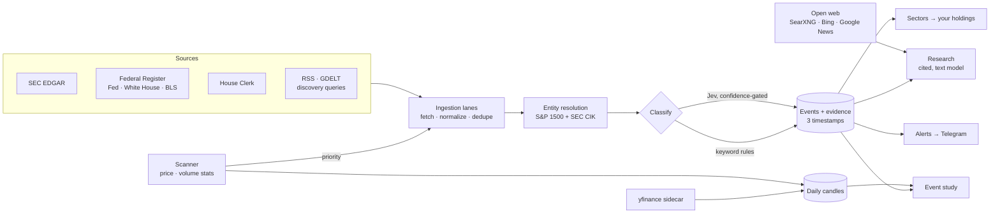

<div align="center">

# Bellwether

**Self-hosted market intelligence for US equities — every claim with a receipt.**

Bellwether watches SEC filings, federal policy, Congressional trades and the
news; ties each event to the companies and sectors it touches; and tells you,
with measured history rather than a hunch, whether events like it have
actually moved prices before.

[](go.mod)
[](web/)
[](docker-compose.yml)
[](LICENSE)


</div>

> **Bellwether places no orders.** There is no order-placement code path of
> any kind. It watches, measures and explains. Analysis tool, not investment
> advice; data may be delayed.

---

## Why

A Bloomberg Terminal costs $24,000 a year, and a large part of what it sells
is the link between a world event and your positions. Retail tools show you
*what* moved, rarely *why*, and never which of *your* holdings a rule change,
a filing or a Congressional trade actually reaches. AI finance chatbots answer
confidently and cite nothing — you cannot audit them, so you cannot trust
them.

Bellwether fills that gap on a small VPS (4 GB of RAM is plenty):

```
filing · policy change · world event  ──▶  which sectors it reaches
                                      ──▶  which of your holdings sit there
                                      ──▶  what events like it did before
                                      ──▶  the sources, so you can check
```

## What makes it trustworthy

**Provenance you can audit.** Every event keeps three timestamps — when it
happened, when it was published, and when *this system* discovered it — and
only the last is ever used to reason about what was knowable when. Look-ahead
bias isn't avoided by convention; it's structurally impossible. Every event
links to every source that reported it, ranked by trust.

**Statistics decide what to look at; models only explain it.** A scanner
reads price and volume across the S&P 1500 every session and flags what is
abnormal *before any article exists about it*. Models are the last stage of
the pipeline, never the first.

**The right model for each job.** Thousands of small classification
decisions a day go to [Jev](https://typesafe.ai), a typed decision model
whose answers come with a calibrated confidence — and are thrown out when that
confidence is too low. Prose goes to any OpenAI-compatible model, behind a
hard daily dollar cap that concurrent calls cannot overshoot.

**Citations or it didn't happen.** Research cites its sources, flags where
they disagree and names what they fail to establish. A citation to a source
that was never supplied is stripped; a finding with no valid citation is
dropped, not softened. Every AI forecast is scored against what actually
happened, and the track record is on its own page.

## What's inside

| | |
| --- | --- |
| **News** | SEC EDGAR (8-K, Form 4, 13F), the Federal Register, the Fed, the White House, BLS, the FTC, the wires and financial press, GDELT, targeted discovery queries and one source per watched stock — deduplicated, entity-resolved, and classified into ~50 event types. A search also shows what the open web has. |
| **Today** | What changed overnight: unexplained moves, alerts, upcoming catalysts and a cited morning brief. |
| **Charts** | Candles with studies and drawing tools, and beside them what is known about the stock: valuation against its sector, recent news and signals, insider and fund activity, web headlines, and the AI's explanation, debrief and scored outlook. |
| **Signals** | The statistical scanner: abnormal price and volume across the universe, every half hour of the session. A move nothing in the archive explains is one click from a web search. |
| **Policy & macro** | Macro, regulatory and trade events fanned out to the sectors they touch, and to *your* holdings. |
| **Who's buying** | Insider trades from SEC Form 4, the quarterly moves of 14 well-known funds from their 13Fs, and House STOCK Act disclosures with how late each was filed. |
| **Event study** | For any event type: mean and median abnormal return vs. the S&P 500, hit rate, sample size, and honest small-sample warnings. |
| **Catalysts** | Upcoming earnings and dividends across the universe, each with the event study's base rate attached. |
| **Research** | Ask a question; get a cited answer from filings, official releases, measured price history and the open web (a private SearXNG node, Bing News and Google News) — or evidence only, with no model at all. |
| **Positions & journal** | What you hold and what you closed, each trade set against the event that preceded it. |
| **Algorithms & backtests** | A JSON rule language over indicators with unknown-aware logic, run on a schedule, with a leakage-free backtester. |
| **Alerts** | Rule triggers to Telegram and the in-app feed, with the full evaluation snapshot kept for audit. |
| **AI track record** | Every AI outlook scored against what happened: calibration, skill against a baseline, and the forecasts themselves. |

Every clock time names its zone — New York by default, your own or UTC by choice.

<table>
<tr>
<td width="50%"></td>
<td width="50%"></td>
</tr>
<tr>
<td width="50%"></td>
<td width="50%"></td>
</tr>
</table>

## Quick start

You need Docker. Nothing else — no keys are required to start.

```bash
git clone https://github.com/premalshah999/BELLWETHER.git bellwether && cd bellwether
cp .env.example .env
docker compose up -d
docker compose exec tradesys tradesys -issue-key -name "alice" -role owner
```

Open <http://localhost:8080> and sign in with the key it printed.

Out of the box you get the official sources, prices from the bundled yfinance
sidecar, the scanner, Congress, the event study, web search through the
bundled SearXNG node, and evidence-only research.
Each key you add switches on more:

| Add | To get |
| --- | --- |
| `SEC_USER_AGENT` — a contact string, no signup | SEC filings: 8-Ks, insider trades, 13Fs |
| `TYPESAFE_API_KEY` | Jev classification: event type, importance, direction |
| `LLM_BASE_URL` + `LLM_API_KEY` (DeepSeek, OpenAI, Ollama…) | briefs, explanations, AI research answers |
| `TELEGRAM_BOT_TOKEN` + `TELEGRAM_CHAT_ID` | alerts on your phone |
| `PUBLIC_HOSTNAME` + `COMPOSE_PROFILES=public` | HTTPS on your own domain via Caddy |

Every variable is annotated in [`.env.example`](.env.example).

## How it works



One Go binary with the React frontend embedded, one Postgres, and a small
Python sidecar. Every external dependency sits behind an interface, and every
feature degrades on its own when its dependency is missing — no keys, no
model, no archive database, and the app still boots.

## Documentation

| | |
| --- | --- |
| [Architecture](docs/architecture.md) | layout, seams, provenance, symbols, split news storage |
| [The AI layer](docs/ai.md) | Jev vs. the text model, confidence gates, spend guards, calibration |
| [Operations](docs/operations.md) | deploying, access keys, one-off commands, backups, the universe |
| [Algorithms](docs/algorithms.md) | the rule language and the backtester |
| [API](docs/api.md) | REST endpoints and the error envelope |
| [Research workflow](docs/research-workflow.md) | retrieval, ranking, citation rules and limits |

## Development

Requires **Go 1.27+**, **Node 20+** and **Docker** (for Postgres).

```bash
make dev-db        # Postgres on 127.0.0.1:5433
make web           # build the frontend (the Go binary embeds it)
make run           # backend on :8080
make web-dev       # frontend on :5173 with hot reload, proxying /api
make test          # go vet + unit tests + frontend typecheck
```

Integration tests run against a **dedicated** scratch database, never the one
`DATABASE_URL` points at:

```bash
docker compose exec postgres createdb -U tradesys tradesys_test
TEST_DATABASE_URL=postgres://tradesys:<password>@localhost:5433/tradesys_test?sslmode=disable make test
```

Each test gets its own schema there and drops it afterwards. The storage and
HTTP tests need it and skip when it is unset; CI always sets it, and also runs
the browser smoke tests in `web/tests/`.

## Contributing

Issues and pull requests are welcome — see [CONTRIBUTING.md](CONTRIBUTING.md).
Good first areas: new official data sources (each is a catalogue entry plus a
parser), new indicators, and event-type keyword rules. Please report security
issues privately, as described in [SECURITY.md](SECURITY.md).

## License

[MIT](LICENSE). Data from third-party sources remains subject to each
source's own terms — notably SEC's
[fair-access policy](https://www.sec.gov/os/accessing-edgar-data), which is
why `SEC_USER_AGENT` must name a real contact.
